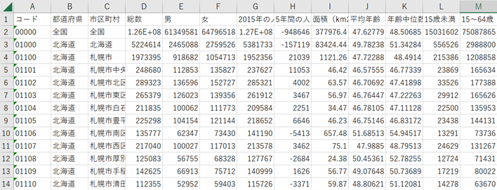
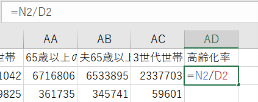
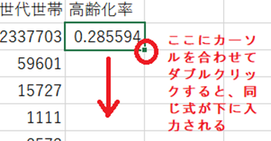
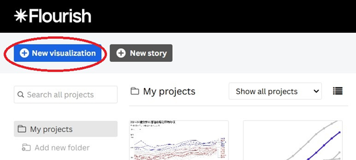
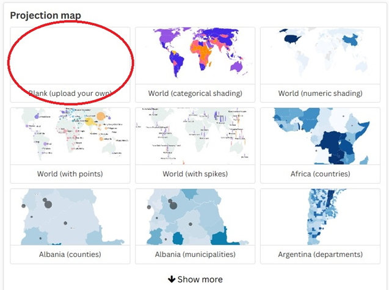
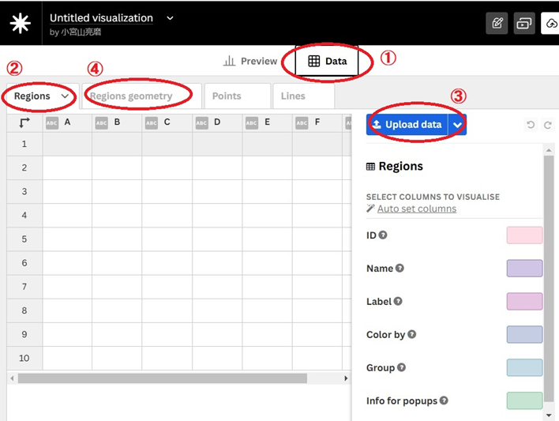
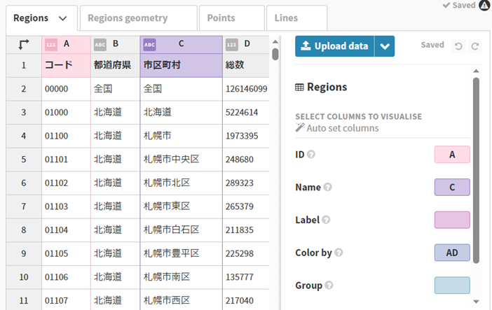
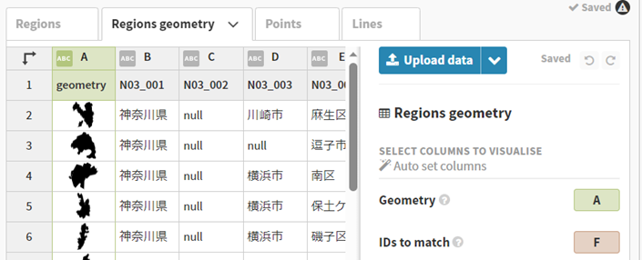
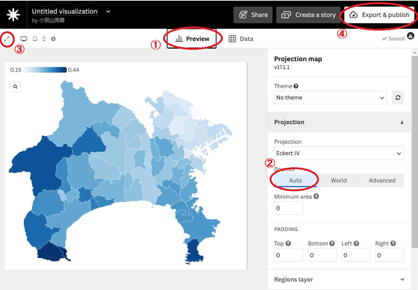

# 公開データを地図に落とし込む

朝日新聞デジタル企画報道部　小宮山亮磨   
@ryomakom   
2024/11/10  

「Flourish」というウェブサービスを使って、国勢調査のデータを触って動かせる地図にしてみます。まずExcelで簡単なデータ分析をして、次にその結果をFlourishで地図にする、という作業です。

以下、そのマニュアルです。

## ステップ１．Excelでデータを加工する

まず、年代別の人口や世帯数などを市区町村ごとに示したデータを[ここ](https://github.com/ryomakom/flourish_map/tree/main/data)からダウンロードします。小宮山が国勢調査データを整理し直したもので、2010年、2015年、2020年の３回分あります（列挙されているデータの項目は三つともほぼ同じです）。元となったデータは政府のe-Statという[サイト](https://www.e-stat.go.jp/stat-search/files?page=1&layout=datalist&toukei=00200521&tstat=000001049104&cycle=0&tclass1=000001049105&tclass2val=0)から入手できます。

次に、ダウンロードしたファイル（これは2020年の分）をExcelで開いて、中身を確認しましょう。

各都道府県、各市区町村について、男女別や年齢別など、さまざまな区分の人口のデータが記されていることがわかります。このデータをもとに、何か分析っぽいことをしてみましょう。今回は例として、人口に占める65歳以上の人の割合を示す「高齢化率」を計算してみます。

右側にスクロールして、空いている「AD」の列に高齢化率を入れていきましょう。いちばん上の行には、それぞれの列の「名前」が入るので、ここには「高齢化率」と入力します。また、65歳以上の人の人口はN列に、人口総数はD列に入っています。なので、上から２番目のマス目に「=N2/D2」と入力してEnterを押すと、全国の65歳以上人口を全人口で割り算して得られる数値が表示されます。

さらに、このマス目を選択した状態で右下にある点にカーソルを合わせてダブルクリックすると、N列をD列で割るという同じ計算を、下に並んでいるすべての行について自動的にやってくれます。この状態でデータを「保存」します。

Excelを使ったデータ加工は、これでひとまず終わりです。

## ステップ２．Flourishでデータを地図にする

次に、加工したデータをもとに、地図に色を塗ることで各市区町村の高齢化率を表現したものを作っていきます。

まず、市区町村の境界線を示すデータを[ここ](https://github.com/ryomakom/flourish_map/tree/main/data/%E5%A2%83%E7%95%8C%E7%B7%9A%E3%83%87%E3%83%BC%E3%82%BF%EF%BC%88%E5%9B%BD%E5%9C%9F%E6%95%B0%E5%80%A4%E6%83%85%E5%A0%B1%E3%80%81%E4%BB%A4%E5%92%8C%EF%BC%93%E5%B9%B4%EF%BC%89)からダウンロードしましょう。「geojson（ジオジェイソン）」という形式のデータで、政府が公開している「行政区域データ」をもとに、データ量を小さくしたり、飛び地で別物扱いされている土地のデータを合体させたり、などの整理をほどこしました。元データは[国土数値情報のサイト](https://nlftp.mlit.go.jp/ksj/gml/datalist/KsjTmplt-N03-v3_1.html)から取ってこられます。47都道府県のうちの13府県があります（独断と偏見で選びました。東京都は沖ノ鳥島など極端な離島のデータを含んでいるので、地図にすると23区が極めて小さく表示される難があるため割愛）。

さて、いよいよ[Flourishのサイト](https://flourish.studio/)に行ってみましょう。ログインしたら、New Visualizationというボタンをクリックします。

下の方にスクロールして、Projection mapという項目の最初にある「Blank」というひな型をクリックします。

上の方にあるDataタブ（①）をクリックし、次にRegionsタブ（②）をクリックしたうえで、Upload dataのボタン（③）をクリックすることで、先ほど「高齢者率」の列を追加した「国勢調査データ.xlsx」をインポートできます。さらにRegions geometryのタブ（④）をクリックし、地図をつくりたい府県の境界線データ（この例では「神奈川.geojson」）を選んで、もういちどUpload dataのボタン（③）をクリックしてインポートしましょう。

これで、地図に表したいデータ（＝中身）がRegionsのタブのほうに、また市区町村の境界線（＝入れ物）のデータがRegions geometryのタブのほうに、それぞれ入ったことになります。

次に、白地図に色をつけていくために、入れ物と中身の対応関係を指定する「突合」の作業が必要になります。

各市区町村に割り振られたコードが、RegionsとRegions geometryという二つのデータを突合する鍵です。Regionsタブのほうでは、コードはA列に入っています。そこで、突合の鍵を意味する「ID」を指定する場所に「A」と入力します。

また、地図ではカーソルを市区町村の上に乗せたときに、その自治体の名前が表示されるようにしたいと思います。このため、「Name」のところに、市区町村名が入った列名の「C」を入力します。さらに「Color by」の場所には、今回の分析対象としている高齢化率が入った列「AD」を入力します。Color byというのは、高齢化率の高低を地図の色分けとして表現する、という意味です。

次にRegions geometryのタブに移ります。こちらでは、突合の鍵を指定する「IDs to match」のところに、市区町村コードが入った「F」を入力します。地図を描くための「geometry」には、市区町村の境界線データが入った「A」を入力します。

これでデータはすべてそろいました。あとは細かい調整です。

Previewのタブ（①）をクリックし、右にあるProjectionのBoundsをAutoにする（②）と、神奈川県の地図が上のように描画されます（設定がWorldになっていると世界全体が描かれるので、神奈川県は小さすぎて見えなくなってしまいます）。高齢者比率の高いところが濃い青色で表現されていますね。

次に、左上の拡大ボタン（③）をクリックすると、全画面でプレビューできます。気に入ったら編集画面に戻り、右上のExport & publishボタン（④）を押せば、完成版をウェブ上に公開できます。

お疲れ様でした！
